# 💫 About Me

💻 Motivated **MERN Stack Software Engineer** with a passion for building responsive and dynamic full-stack web applications.  
🛠️ Skilled in modern frontend and backend technologies such as **React.js, Node.js, Express, MongoDB**, and **Next.js**.  
🤝 Team player with strong problem-solving skills and a focus on writing clean, maintainable code following best practices.  
🚀 Constantly exploring new tools, frameworks, and ways to improve performance and user experience.

---

## 🌐 Connect With Me

---

## 💻 Tech Stack

**Languages**  

**Frontend**  

**Styling**  

**Backend & Tools**  

**Other Tools**  

---

## 📊 GitHub Stats

<table>
  <tr>
    <td>
      
    </td>
    <td>
      
    </td>
  </tr>
</table>

---

## 🚀 Projects

### 🔹 [Movie App](https://moviereactsite.netlify.app/)
A modern React.js movie browsing app with dark theme, search functionality, image slider, and context-based state management.  
**Tech Stack**: React.js, React Router, Bootstrap, Context APIpt

  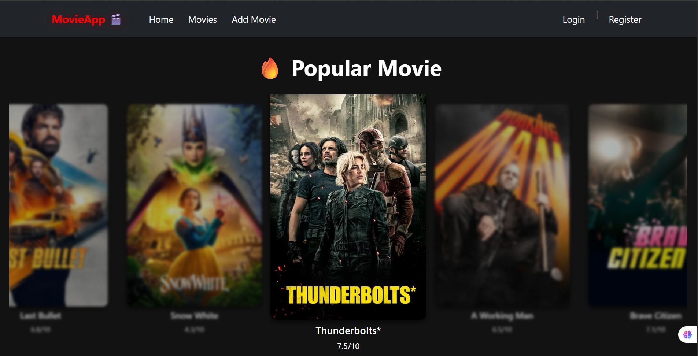
  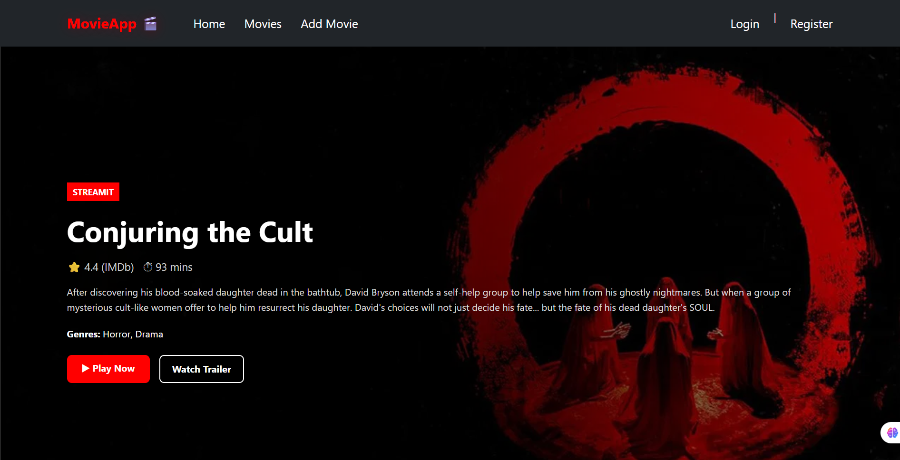
  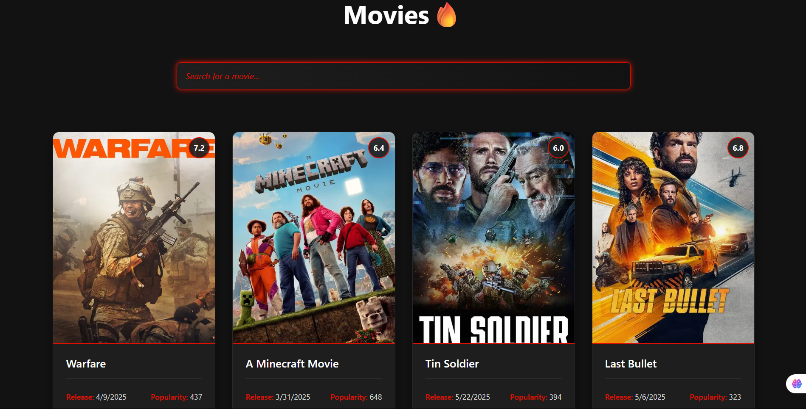
  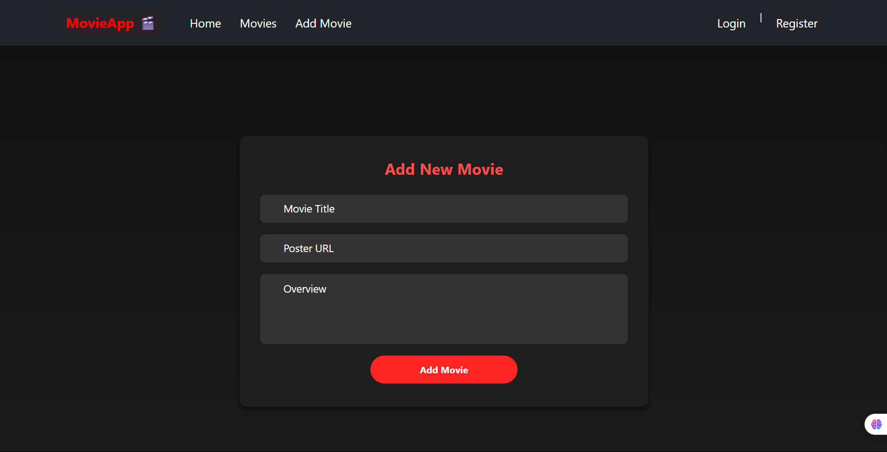

---

### 🔹 [Nextstore – Product Manager](https://next-crud-app.netlify.app/)
A full-stack Next.js 13 product management app with seamless CRUD operations, Material-UI design, RESTful API integration, and App Router-based architecture.  
**Tech Stack**: Next.js 13, MUI, RESTful API

  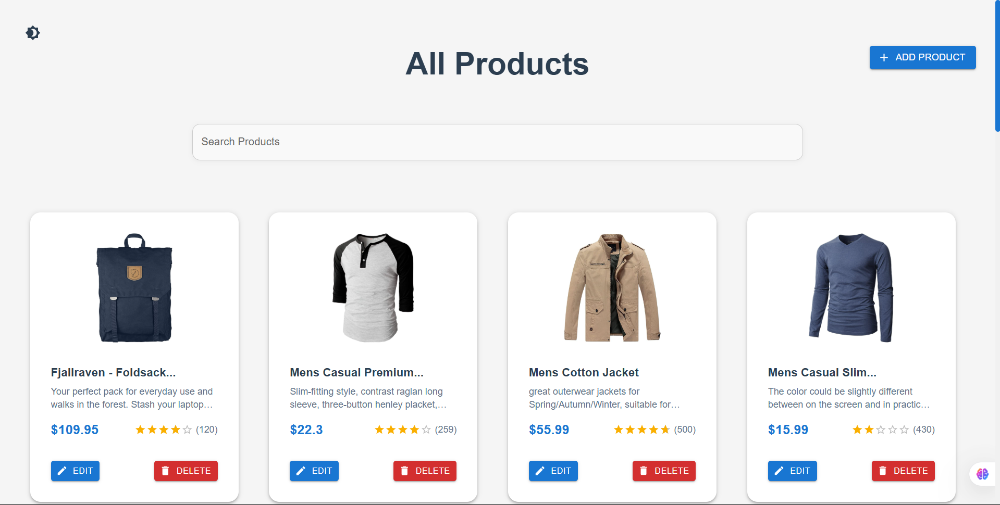
  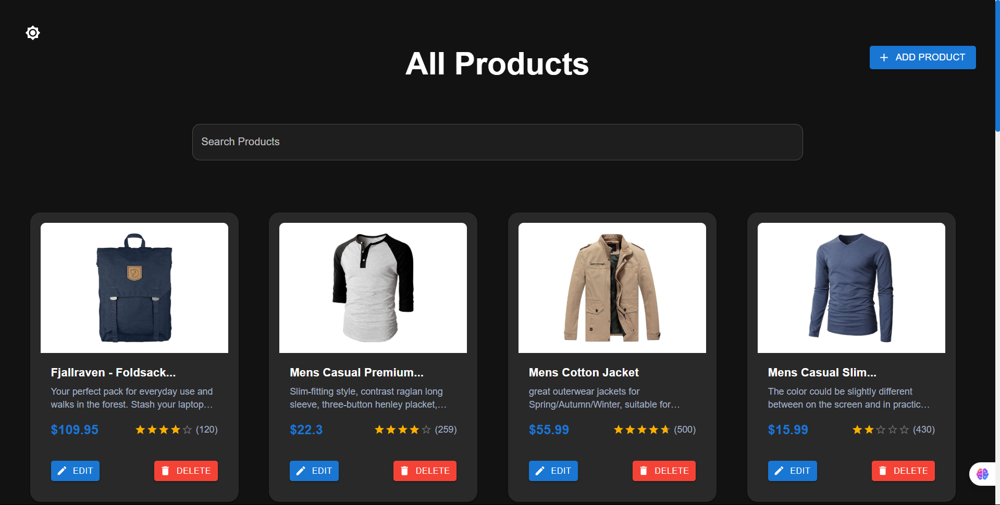

---

### 🔹 [Yummy – Food Discovery App](https://youssefezzat17.github.io/Yummy/)
An elegant UI to discover delicious meals and recipes with responsive design and real-time search.  
**Tech Stack**: HTML5, CSS3, JavaScript, Bootstrap, jQuery

  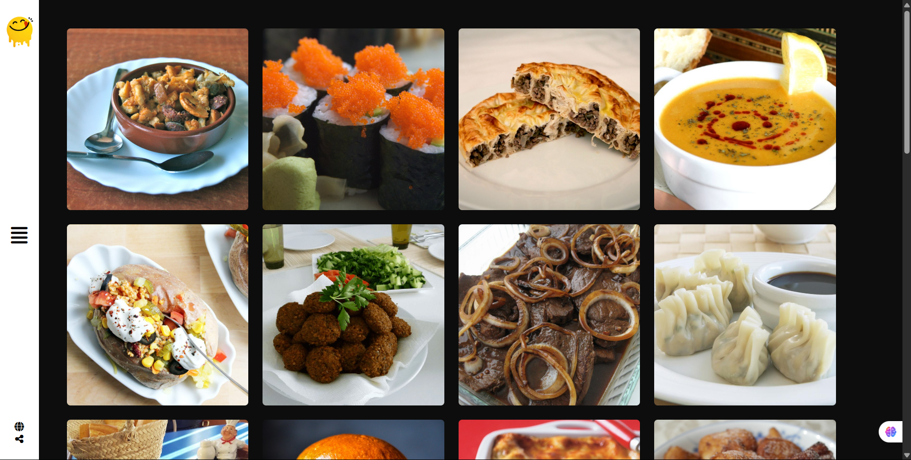
  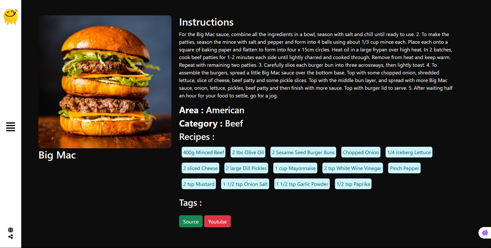

---

### 🔹 [Memory Game](https://memorygame-site.netlify.app/)
A browser-based game to test and improve short-term memory with card matching logic.  
**Tech Stack**: HTML5, CSS3, JavaScript

  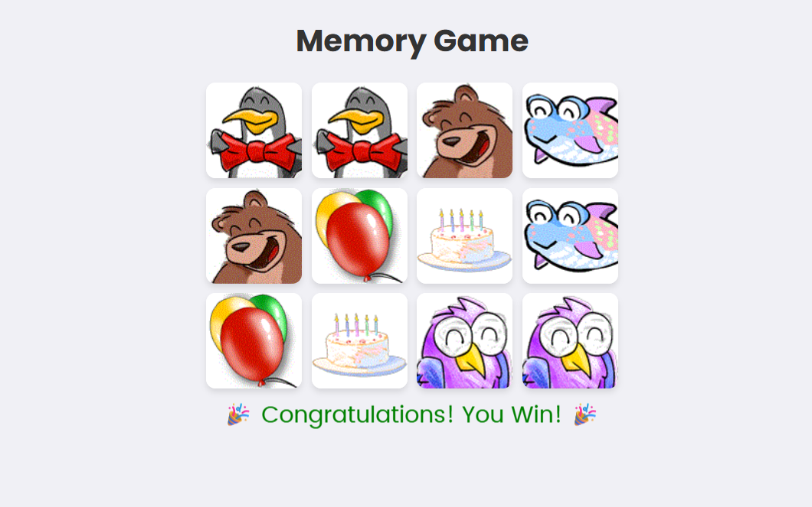

---

### 🔹 [Weather App](https://youssefezzat17.github.io/weather/)
Simple and clean 3-day forecast app that allows users to view weather data by country.  
**Tech Stack**: HTML5, CSS3, JavaScript

  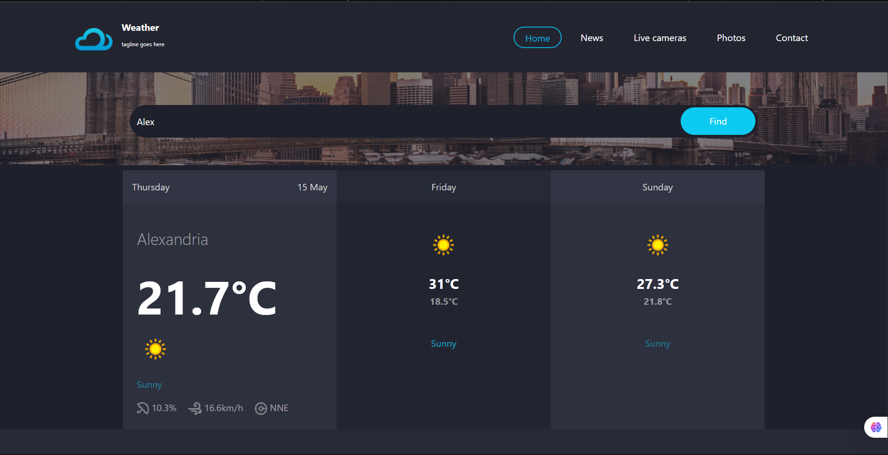

---

### 🔹 [VueStock – Product Management Dashboard](https://github.com/YoussefEzzat17/Vue-CRUD-Operations)
A dynamic product management dashboard with advanced routing, search, filtering, and real-time CRUD functionality.  
**Tech Stack**: Vue.js, Vuex, Axios, Bootstrap

---

### 🔹 [DevFolio – Personal Portfolio Website](https://youssefezzat17.github.io/Devfolio/)
A portfolio to showcase skills, projects, and contact info using modern HTML/CSS layout.  
**Tech Stack**: HTML5, CSS3, JavaScript, Bootstrap

  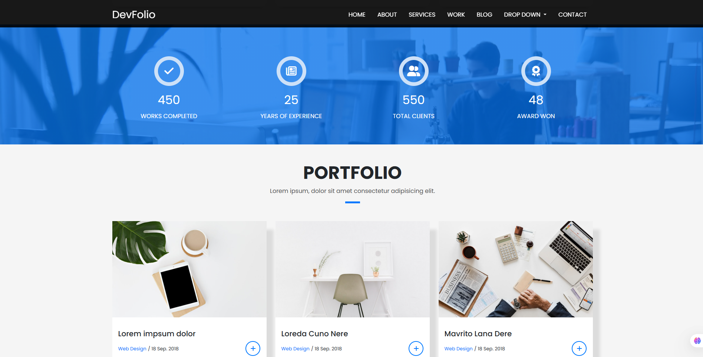

---

<!-- Proudly created with GPRM (https://gprm.itsvg.in) -->
